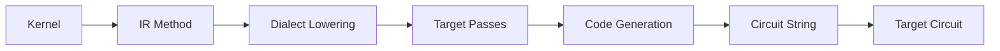

## Overview

Circuits in Bloqade represent the compiled form of quantum kernels. They are the bridge between high-level quantum programs written with the Bloqade eDSL and the low-level instructions executed on quantum hardware or simulators.

## Circuit Types

Bloqade supports multiple circuit backends, each optimized for different execution targets:

### STIM Circuits

STIM is a fast stabilizer circuit simulator. Bloqade can compile kernels directly to STIM circuits:

```python
from bloqade.stim import Circuit

class Circuit(stim.Circuit):
    def __init__(self, kernel: ir.Method):
        """Initialize stim.Circuit from a kernel.
        
        This class inherits from `stim.Circuit`. For the full API reference of
        the underlying circuit class, see:
        https://github.com/quantumlib/Stim/blob/main/doc/python_api_reference_vDev.md#stim.Circuit
        
        Args:
            kernel: The kernel to compile into a stim.Circuit.
        """
```

**Installation:**

```bash
pip install "bloqade-circuit[stim]"
```

**Example usage:**

```python
import stim
from bloqade import squin
from bloqade.stim import Circuit

@squin.kernel
def bell_state():
    q = squin.qalloc(2)
    squin.h(q[0])
    squin.cx(q[0], q[1])

circuit = Circuit(bell_state)
assert isinstance(circuit, stim.Circuit)
print(circuit)
# Output:
# H 0
# CX 0 1
```

### TSIM Circuits

TSIM is QuEra's tensor network simulator. Compile kernels to TSIM for efficient simulation:

```python
from bloqade.tsim import Circuit

class Circuit(tsim.Circuit):
    def __init__(self, kernel: ir.Method):
        """Initialize tsim.Circuit from a kernel.
        
        This class inherits from `tsim.Circuit`. For the full API reference of
        the underlying circuit class, see:
        https://queracomputing.github.io/tsim/latest/reference/tsim/circuit/
        
        Args:
            kernel: The kernel to compile into a tsim.Circuit.
        """
```

**Installation:**

```bash
pip install "bloqade-circuit[tsim]"
```

**Example usage:**

```python
import tsim
from bloqade import squin
from bloqade.tsim import Circuit

@squin.kernel
def ghz_state():
    q = squin.qalloc(3)
    squin.h(q[0])
    squin.cx(q[0], q[1])
    squin.cx(q[1], q[2])

circuit = Circuit(ghz_state)
assert isinstance(circuit, tsim.Circuit)
```

## Compilation Process

When you create a circuit from a kernel, Bloqade performs several steps:



### 1. IR Representation

Kernels are first compiled to Kirin's intermediate representation (IR):

```python
from kirin import ir

@squin.kernel
def my_circuit():
    q = squin.qalloc(2)
    squin.h(q[0])
    return q

# Access the IR
method: ir.Method = my_circuit
method.print()  # Display IR structure
```

### 2. Dialect Transformations

The IR is transformed through dialect-specific passes:

```python
# For STIM compilation
from bloqade.stim.passes import SquinToStimPass

method = method.similar()
SquinToStimPass(method.dialects)(method)
```

### 3. Code Emission

Finally, the transformed IR is emitted as circuit instructions:

```python
import io
from bloqade.stim.emit import EmitStimMain
from bloqade.stim import groups as bloqade_stim

buf = io.StringIO()
emit = EmitStimMain(dialects=bloqade_stim.main, io=buf)
emit.initialize()
emit.run(method)
program = buf.getvalue()
```

## Circuit Operations

### Inspection

Circuits can be inspected and analyzed:

```python
from bloqade.stim import Circuit

@squin.kernel
def test_circuit():
    q = squin.qalloc(3)
    squin.h(q[0])
    squin.cx(q[0], q[1])
    squin.cx(q[1], q[2])

circuit = Circuit(test_circuit)

# Print circuit
print(circuit)

# For STIM circuits, use the full STIM API
print(f"Number of qubits: {circuit.num_qubits}")
print(f"Number of operations: {len(circuit)}")
```

### Simulation

STIM circuits can be simulated directly:

```python
import stim
from bloqade.stim import Circuit

circuit = Circuit(test_circuit)

# Create a simulator
sampler = circuit.compile_sampler()

# Sample measurements
samples = sampler.sample(shots=1000)
print(samples.shape)  # (1000, num_measurements)
```

## Advanced Features

### Parameterized Circuits

Kernels can accept parameters that affect the compiled circuit:

```python
from bloqade import squin

@squin.kernel
def rotation_circuit(angle: float):
    q = squin.qubit.new()
    squin.rx(q, angle)
    return squin.qubit.measure(q)

# Compile with specific parameter
circuit = Circuit(rotation_circuit.specialize(angle=3.14159))
```

### Multi-Dialect Compilation

Bloqade kernels can target multiple circuit formats:

```python
from bloqade import squin
from bloqade.stim import Circuit as StimCircuit
from bloqade.tsim import Circuit as TsimCircuit

@squin.kernel
def universal_kernel():
    q = squin.qalloc(2)
    squin.h(q[0])
    squin.cx(q[0], q[1])

# Compile to different targets
stim_circuit = StimCircuit(universal_kernel)
tsim_circuit = TsimCircuit(universal_kernel)
```

### Circuit Optimization

Bloqade applies optimization passes during compilation:

- **Gate fusion**: Combine adjacent single-qubit gates
- **Dead code elimination**: Remove unused operations
- **Dialect-specific optimizations**: Target-specific improvements

## Integration with Devices

Circuits work seamlessly with [devices](/concepts/devices):

```python
from bloqade.pyqrack import StackMemorySimulator

@squin.kernel
def my_algorithm():
    q = squin.qalloc(5)
    # ... quantum operations ...
    return squin.broadcast.measure(q)

# Option 1: Direct device execution
sim = StackMemorySimulator(min_qubits=5)
result = sim.run(my_algorithm)

# Option 2: Compile to circuit first (for inspection/analysis)
from bloqade.stim import Circuit
circuit = Circuit(my_algorithm)
print(circuit)  # Inspect before running

# Then run on device
result = sim.run(my_algorithm)
```

## Error Handling

<Warning>
  Circuit compilation may fail if:
  - The kernel uses unsupported operations for the target
  - Required circuit backend is not installed
  - The kernel has type errors or invalid operations
  
  Always handle import errors when using optional backends:
  
  ```python
  try:
      from bloqade.stim import Circuit
  except ImportError:
      print("STIM not installed. Run: pip install 'bloqade-circuit[stim]'")
  ```
</Warning>

## Best Practices

<AccordionGroup>
  <Accordion title="Choose the right backend">
    - Use **STIM** for stabilizer circuits and error correction
    - Use **TSIM** for general quantum circuits with tensor network simulation
    - Consider the circuit size and desired simulation method
  </Accordion>
  
  <Accordion title="Inspect before execution">
    Compile to a circuit first to verify the generated instructions:
    
    ```python
    circuit = Circuit(kernel)
    print(circuit)  # Review before running
    ```
  </Accordion>
  
  <Accordion title="Reuse compiled circuits">
    If running the same kernel multiple times, compile once:
    
    ```python
    circuit = Circuit(kernel)
    # Reuse circuit for multiple simulations
    sampler = circuit.compile_sampler()
    results1 = sampler.sample(1000)
    results2 = sampler.sample(1000)
    ```
  </Accordion>
</AccordionGroup>

## Related Concepts

<CardGroup cols={3}>
  <Card title="Devices" icon="microchip" href="/concepts/devices">
    Execute circuits on quantum devices
  </Card>
  <Card title="Tasks" icon="list-check" href="/concepts/tasks">
    Manage circuit execution with tasks
  </Card>
  <Card title="Qubits" icon="atom" href="/concepts/qubits">
    Understand qubit operations in circuits
  </Card>
</CardGroup>
